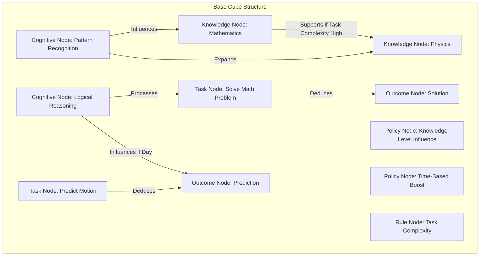

### README.md for Cube4D: The Final Programming Framework

---

# Cube4D - The Final Programming Framework

**Cube4D** is a transformative 4-dimensional programming framework built to advance complex data processing, dynamic rule-based computation, and adaptable graph relationships. This framework pushes the boundaries of structured, policy-driven AI and computational modeling by establishing a foundation where data, processes, relationships, and time-based changes interact in a seamlessly integrated model. Cube4D leverages both cognitive and logical nodes that adapt to user-defined policies and conditions over time, building a platform capable of tackling complex problems in real-time.

---

## Project Vision and Inspiration

Cube4D began with the simple yet profound realization that complex systems need a framework that can adapt dynamically while retaining structure and simplicity. Influenced by principles of graph theory, directory structures, and the intrinsic relationships within data, Cube4D has evolved to unify these fields into a holistic, rule-driven platform.

The framework is an outgrowth of an iterative journey in AI, abstract reasoning, and cognitive modeling, focusing on empowering users to define nodes, relationships, and outcomes that adjust based on external factors like time, conditional policies, and domain-specific knowledge. My journey to create Cube4D also reflects my own growth as a solution architect, driven by the pursuit of simplicity within complexity.

---

## Core Features

Cube4D is built around a base cube of nodes and relationships, optimized for dynamic policy-driven decision-making and logical processing. The base cube below forms the foundation, supporting complex, high-level processing by connecting **Cognitive** nodes (for reasoning), **Knowledge** nodes (for domain-specific information), **Task** nodes (to represent actionable processes), and **Outcome** nodes (for results), all governed by adaptable **Policy** and **Rule** nodes.

---

## Base Cube for Complex Processing

The following JSON schema illustrates Cube4D’s initial structure, optimized for intelligent and adaptable data processing:

```json
{
    "T_0": {
        "nodes": {
            "C1": {"type": "Cognitive", "description": "Pattern recognition"},
            "C2": {"type": "Cognitive", "description": "Logical reasoning"},
            "K1": {"type": "Knowledge", "description": "Mathematics"},
            "K2": {"type": "Knowledge", "description": "Physics"},
            "T1": {"type": "Task", "description": "Solve math problem"},
            "T2": {"type": "Task", "description": "Predict motion"},
            "O1": {"type": "Outcome", "description": "Solution to math problem"},
            "O2": {"type": "Outcome", "description": "Prediction of motion"},
            "P1": {"type": "Policy", "description": "Increase influence for higher knowledge level"},
            "P2": {"type": "Policy", "description": "Apply time-based boost to logical reasoning"},
            "R1": {"type": "Rule", "description": "Outcome depends on knowledge and task complexity"}
        },
        "relationships": [
            {"source": "C1", "target": "K1", "relationship_type": "influences", "policy": "P1"},
            {"source": "C2", "target": "T1", "relationship_type": "processes", "policy": "P2"},
            {"source": "T1", "target": "O1", "relationship_type": "deduces", "rule": "R1"},
            {"source": "C1", "target": "K2", "relationship_type": "expands", "policy": "P1"},
            {"source": "T2", "target": "O2", "relationship_type": "deduces", "rule": "R1"},
            {"source": "C2", "target": "O2", "relationship_type": "influences if", "condition": {"time_period": "day"}},
            {"source": "K1", "target": "K2", "relationship_type": "supports if", "condition": {"task_complexity": "high"}}
        ],
        "dependency_index": {
            "cube_reference": "AGI_base_cube",
            "dependencies": []
        }
    }
}
```

This base cube serves as the **central processing structure** of Cube4D, containing dynamic elements that can expand and scale to new nodes, relationships, and conditions. These elements interact based on adaptable policies and rules, supporting a vast range of applications, from artificial intelligence modeling to complex systems analysis.

### Key Elements

1. **Nodes**: Represent cognitive, knowledge, task, and outcome points within the system.
2. **Policies**: Control influence and adaptability of relationships, providing a rule-based governance layer.
3. **Rules**: Define logic for conditional outcomes and guide decision-making processes.
4. **Conditions**: Adapt relationships based on time and other external factors.

---

## Breakthrough Concepts and Principles

### 1. **4D Structure and Dynamic Adaptability**
Cube4D introduces a flexible 4D structure where each node can change in relation to others over time. This framework is capable of adapting relationships and states through defined rules and policies, enabling powerful applications that evolve as conditions shift.

### 2. **Hierarchical Node Management and Efficiency**
Through layers of cognitive and knowledge nodes, Cube4D maps tasks and outcomes with exceptional efficiency. Using a bit-level scalable approach, the framework allows optimal storage for vast and intricate datasets.

### 3. **Policy and Rule Management for Adaptive Processing**
Policies and rules in Cube4D drive the framework's ability to handle complex, multi-faceted tasks. By embedding policies directly into the framework, Cube4D builds an interactive, decision-oriented model.

### 4. **Efficiency and Scalability through Bit-Level Storage**
Cube4D’s adaptable bit-level system ensures that its architecture scales efficiently, making it an ideal model for both high-performance computing applications and everyday complex processing tasks.

---

## Diagrammatic Representation

### Core Cube4D Workflow Diagram


---

## Getting Started

To implement Cube4D, start by setting up the base cube structure as shown above, defining nodes and relationships specific to your use case.

### Sample Code

```python
from cube4d import Cube4D

# Initialize Cube4D Framework
cube = Cube4D()

# Add Cognitive, Knowledge, Task, Outcome Nodes
cube.add_node("C1", type="Cognitive", description="Pattern recognition")
cube.add_node("K1", type="Knowledge", description="Mathematics")
cube.add_node("T1", type="Task", description="Solve math problem")
cube.add_node("O1", type="Outcome", description="Solution to math problem")

# Define Relationships with Policies and Rules
cube.add_relationship("C1", "K1", "influences", policy="P1")
cube.add_relationship("T1", "O1", "deduces", rule="R1")
cube.add_policy("P1", description="Increase influence for higher knowledge level")
cube.add_rule("R1", description="Outcome depends on knowledge and task complexity")
```

### Roadmap

1. **Core Release (Version 1.0)**
   - Complete Base Cube Structure for general processing
   - Implement key cognitive and task nodes
   - Define policies and rules for adaptability

2. **Advanced Policies and Conditions (Version 1.1)**
   - Add complex, conditionally adaptable relationships
   - Build time-based processing rules

3. **Optimization and Scaling (Version 1.2)**
   - Integrate bit-level storage for large datasets
   - Enable high-performance and real-time applications

---

## Contributing

We welcome contributions to Cube4D! Feel free to open issues or submit pull requests. Guidelines for contribution are available in the CONTRIBUTING file.

## License

Cube4D is licensed under the MIT License. See the LICENSE file for more information.
