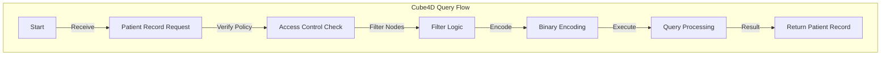

# Cube4D: The Final Programming Framework - Active Graph Networks (AGN)

**Cube4D**, an advanced framework in 4-dimensional programming, combines principles from data organization, graph theory, and Active Directory-style policies to create **Active Graph Networks (AGN)**. This model enables complex, adaptive data handling that scales with complexity, allowing real-time intelligence and dynamic relationship adjustments. Cube4D introduces a new paradigm for handling relationships, processing rules, and programming logic across multi-dimensional data structures, optimized for applications like healthcare, AI, and real-time analytics.

---

## Introduction

### What is Cube4D?
Cube4D brings the adaptability of active policies into a graph-like structure, where each node interacts based on set policies, rules, and adaptable conditions. **AGN** represents each element in a dynamic, relationship-based framework, ideal for high-complexity tasks requiring flexible, evolving data connections.

### Vision and Background
Cube4D was born from years of iterative work in AI, data systems, and a personal drive to solve multi-faceted problems through structured, scalable frameworks. The aim is to bridge abstract reasoning with practical applications, creating a universally adaptable system capable of handling real-world complexity with clarity and precision.

---

## Core Concepts

### 1. **The What, Why, and How**
   - **What (X-Axis):** Core information or data stored.
   - **Why (Y-Axis):** Relationships or connections between data.
   - **How (Z-Axis):** Logical processes or rules applied.
   - **Outcome (Effectus):** The cumulative result of these elements.

### 2. **Active Graph Principles: Effectus and Quomodo**
   - **Effectus:** Represents the output from combined dimensions (X, Y, Z).
   - **Quomodo:** The structured method of processing, scaling up with complexity and adaptability.

---

## Multi-dimensional Bit Encoding and Efficiency

Cube4D uses a highly efficient binary encoding structure, allowing compact, flexible representation for any node or relationship:
   - **Binary Encoding Structure**: Each node, query, or relationship has a unique binary signature.
   - **Scalability with Bits**: Cube4D enables structured scaling (e.g., 7-bit, 14-bit) that adds additional data dimensions while maintaining efficiency.
   - **Policy and Rule-Driven Relationships**: Policies dynamically adjust relationships, adapting based on context (e.g., time or user-defined conditions).

---

## Node Types and Interactions

Cube4D’s data model includes various node types:
   - **Cognitive Nodes**: Pattern recognition, logical reasoning.
   - **Knowledge Nodes**: Domain-specific data, e.g., mathematics, physics.
   - **Task and Outcome Nodes**: Objectives and results.
   - **Policy and Rule Nodes**: Policies adapt relationships; rules govern task outcomes.

Each node type interacts within the Cube4D structure, building complex, adaptable networks suitable for AI, data systems, and dynamic access control.

---

## Core Cube4D Example

Below is the Cube4D schema demonstrating adaptable policy-driven relationships:

```json
{
    "T_0": {
        "nodes": {
            "C1": {"type": "Cognitive", "description": "Pattern recognition"},
            "C2": {"type": "Cognitive", "description": "Logical reasoning"},
            "K1": {"type": "Knowledge", "description": "Mathematics"},
            "K2": {"type": "Knowledge", "description": "Physics"},
            "T1": {"type": "Task", "description": "Solve math problem"},
            "T2": {"type": "Task", "description": "Predict motion"},
            "O1": {"type": "Outcome", "description": "Solution to math problem"},
            "O2": {"type": "Outcome", "description": "Prediction of motion"},
            "P1": {"type": "Policy", "description": "Increase influence for higher knowledge level"},
            "P2": {"type": "Policy", "description": "Apply time-based boost to logical reasoning"},
            "R1": {"type": "Rule", "description": "Outcome depends on knowledge and task complexity"}
        },
        "relationships": [
            {"source": "C1", "target": "K1", "relationship_type": "influences", "policy": "P1"},
            {"source": "C2", "target": "T1", "relationship_type": "processes", "policy": "P2"},
            {"source": "T1", "target": "O1", "relationship_type": "deduces", "rule": "R1"},
            {"source": "C1", "target": "K2", "relationship_type": "expands", "policy": "P1"},
            {"source": "T2", "target": "O2", "relationship_type": "deduces", "rule": "R1"},
            {"source": "C2", "target": "O2", "relationship_type": "influences if", "condition": {"time_period": "day"}},
            {"source": "K1", "target": "K2", "relationship_type": "supports if", "condition": {"task_complexity": "high"}}
        ]
    }
}
```

### Diagrammatic Representation


---

## Applications and Use Cases

### Healthcare
   - Dynamically filter and interpret patient records.
   - Efficiently handle complex data queries, e.g., kinship or doctor-patient relationships.

### AI Pattern Recognition
   - Cognitive nodes adapt through time-based reasoning, enabling real-time decision-making in fields like robotics and predictive analytics.

### Dynamic Access Control
   - Policies allow detailed control over access levels based on roles, task complexity, and time, ideal for enterprise environments.

---

## Cube4D Programming Logic

Cube4D’s 4D structure incorporates:
   - **X-Axis:** Information/data nodes.
   - **Y-Axis:** Relational connections.
   - **Z-Axis:** Logical rules and policies.
   - **Temporal Dimension:** Adapts relationships based on external conditions.

---

## Sample Query: Binary Encoding

Example of retrieving a patient record:

```plaintext
Get-Patient-Record | Where {$_.name -eq First:'Arthur'/Last:'Dent'}
Binary: 1011111.0010010.0000010..0010011.0000110
```

---

## Roadmap and Project Development

### Roadmap

**Phase 1**: Finalize Framework and Policies  
**Phase 2**: Expanded Use Cases  
**Phase 3**: Efficiency Optimization  
**Phase 4**: Open-Source Release  

### Project Repository Structure

- `/docs`: Comprehensive documentation.
- `/examples`: Sample queries and encoding examples.
- `/src`: Core framework code.
- `/tests`: Unit tests for policy validation and data encoding.

---

## License

Cube4D is available under the MIT License, promoting collaboration and open-source improvement.
