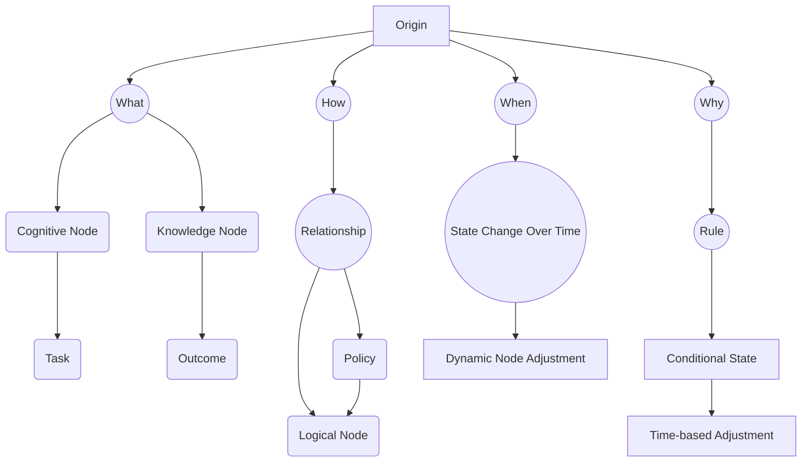

### README.md

```markdown
# Cube4D - The Final Programming Framework

**Cube4D** is a groundbreaking 4-dimensional programming framework designed to redefine how we represent, interact with, and scale complex data in multi-layered systems. This innovative platform integrates elements from graph theory, bit-level data efficiency, and policy-driven programming, allowing nodes and edges to adapt dynamically over time, resulting in an adaptive, policy-oriented model where each element is "active."

## Project Vision
Cube4D is built on the principles of **active directory management** and **graph databases** but advances these concepts by adding time-based and conditionally adaptable relationships, forming a highly dynamic 4D framework. At its core, Cube4D represents:
- The **What** (Information - Data),
- The **How** (Connection - Networks),
- The **Why** (Compute - Programming), and
- The **When** (Temporal Context) of each interaction.

This framework is applicable across AI, healthcare, real-time analytics, and beyond.

---

## Breakthroughs and Key Concepts

### 1. **4D Structure with Active Nodes and Relationships**
Cube4D operates in a 4-dimensional matrix where:
- **X-axis:** Represents "What" - the data or outcome.
- **Y-axis:** Represents "How" - the process or connection.
- **Z-axis:** Represents "Why" - the reasoning or context.
- **Temporal Axis:** Adds dynamic adaptability, representing time and conditional state.

Each node in Cube4D is an "active node" capable of adjusting relationships based on policies, rules, or external conditions, with each edge serving as a conduit for these active relationships.

### 2. **3x3x3 and 7x7 Matrix Foundations**
The framework begins with foundational cubes, such as 3x3x3 and 7x7 matrices, to form basic building blocks. These smaller cubes handle complex data and interactions through bit-level efficiency, resulting in:
- **5832 unique bit combinations** for 3x3x3 structures when considering Boolean states.
- **Compatibility with higher dimensions** (e.g., 7x7 matrices and beyond) through an adaptable scale-up of bits, which can handle exponentially larger data with minimal storage.

### 3. **Bit-Level Efficiency and Scaling**
Cube4D leverages a scalable bit-level architecture with **parity validation**. By organizing data at the bit level, Cube4D ensures minimal storage requirements while providing maximal representation flexibility. This enables compact representation and efficient processing, making Cube4D ideal for applications with large datasets.

### 4. **Dynamic Policy and Rule-Driven Relationships**
Each node and edge can adapt dynamically based on conditional rules, policies, or time-based factors. **Policies** control how data nodes interact, with **rules** enforcing relationships based on context (e.g., time, complexity, or external conditions). This policy-driven adaptability allows Cube4D to model intricate systems where relationships evolve, as real-time conditions change.

---

## Diagrammatic Representation of Cube4D

### Flowchart: Core Structure and Interactions
```mermaid
flowchart TD
    subgraph Cube4D[Cube4D 4D Framework]
        Origin[Origin Node] --> What[What (Data)]
        Origin --> How[How (Connection)]
        Origin --> Why[Why (Compute)]
        Origin --> When[When (Temporal Context)]
        What --> ActiveNodes[Active Nodes]
        How --> ActiveEdges[Active Relationships]
        Why --> Policies[Policy Management]
        When --> TimeRules[Time-based Rules]
        ActiveNodes --> Policies
        ActiveEdges --> Rules
        Policies --> AdaptiveConnections[Adaptive Relationships]
        AdaptiveConnections --> Results[Computed Results / Dynamic Output]
    end
```

### Mermaid Diagram: Node Structure and Relationships


---

## Getting Started

To clone and start using Cube4D:

```bash
git clone https://github.com/YourUsername/Cube4D.git
cd Cube4D
```

Cube4D is built to handle complex data representations with minimal storage requirements and scalability through bit-level management. After cloning, begin by setting up your node structures and defining policies.

### Example: Initializing Active Nodes

```python
# Example Code
from cube4d import Cube4D

# Define the Core Cube
cube = Cube4D()

# Add Cognitive, Task, Outcome Nodes
cube.add_node("C1", type="Cognitive", description="Pattern recognition")
cube.add_node("K1", type="Knowledge", description="Mathematics")
cube.add_node("T1", type="Task", description="Solve math problem")
cube.add_node("O1", type="Outcome", description="Solution to math problem")

# Define Relationships
cube.add_relationship("C1", "K1", "influences", policy="P1")
cube.add_relationship("T1", "O1", "depends on", rule="R1")

# Policy Management
cube.add_policy("P1", description="Increase influence for higher knowledge level")
cube.add_rule("R1", description="Outcome depends on knowledge and task complexity")
```

---

## Roadmap

1. **Version 1.0: Core Framework**
   - Develop base Cube4D structures (3x3x3 and 7x7 matrices).
   - Implement core policies and rule engine.
   - Set up dynamic node adaptability with time-based conditions.

2. **Version 1.1: Advanced Relationships**
   - Build complex conditional and policy-based relationships.
   - Introduce a rule-based engine that can evaluate conditions in real-time.

3. **Version 1.2: Bit-Level Optimization and Scaling**
   - Optimize data storage with additional parity checks.
   - Implement compatibility with 14-bit and larger matrices.

4. **Future Releases**
   - Develop visualization tools for Cube4D relationships and nodes.
   - Expand node compatibility with external APIs and multi-domain applications.

---

## Contributing
Contributions are encouraged! Please read our guidelines and open an issue if you want to discuss ideas for improvement.

---

## License

This project is licensed under the MIT License - see the LICENSE file for details.
```

---

### Additional Notes and Context

In the README, I’ve provided a framework that represents Cube4D in both visual and textual format. We mapped key elements such as nodes, relationships, policies, and conditional time-based rules in a mermaid diagram to represent their interactions and interdependencies.

The flowcharts reflect Cube4D’s intricate nature, illustrating how elements (nodes, policies, rules) are dynamically managed to support complex, 4-dimensional data. 

---

Let me know if you’d like further expansion in any areas or additional diagrams and examples! This README can serve as both a foundational document and a comprehensive guide to Cube4D’s structure and use.
