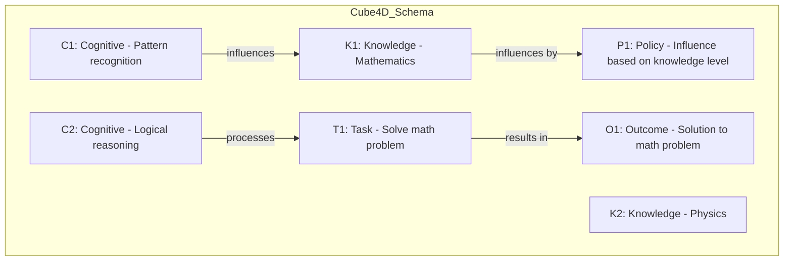
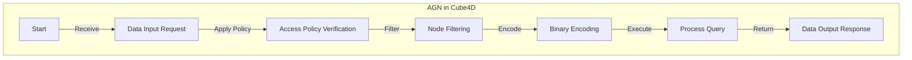
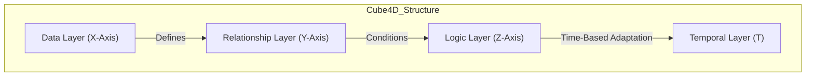
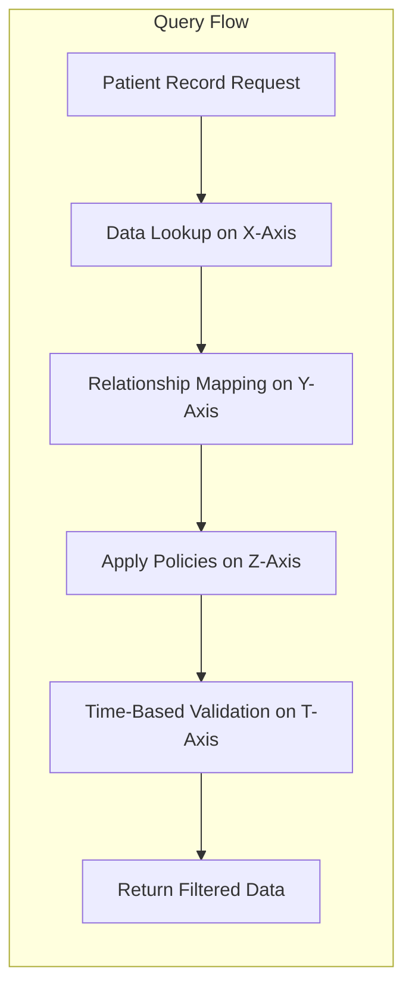

# Cube4D: A Thesis on Active Graph Networks and Four-Dimensional Data Programming

**Author**: *Callum Maystone*

**Abstract**:  
Cube4D represents a paradigm shift in data structuring and programming logic, combining graph theory with multidimensional, policy-driven data interactions. This thesis explores Cube4D’s technical foundations, conceptual structure, and real-world applicability. Originating from insights in data architecture and cognitive reasoning, Cube4D enables dynamic data handling by introducing Active Graph Networks (AGN) — a framework designed to optimize complex data relationships through adaptable policy enforcement, rule-based logic, and time-based conditions.

---

## Background and Motivation

Cube4D was born from a journey through AI model building, healthcare data systems, and an insatiable curiosity for exploring complex relationships in data. This thesis encapsulates that journey, diving into the “how, why, and what” behind Cube4D’s creation. By bridging the gap between abstract reasoning and practical application, Cube4D provides a novel approach to processing logic, policy-driven relationships, and scalable data structures.

---

## Core Philosophical Foundations

Cube4D operates on fundamental principles of structure, purpose, and adaptability, reflected in three key conceptual axes:

1. **X-Axis (What)**: Represents the core data or information — the essence of stored knowledge within the Cube4D framework.
2. **Y-Axis (Why)**: Reflects relational connections, signifying the purpose behind data interlinking and connectivity.
3. **Z-Axis (How)**: Denotes the logic and policies applied to data, adapting dynamically to external conditions.
4. **Temporal Dimension**: Time-based conditions that further refine how data relationships evolve, making them adaptable to change.

Together, these axes facilitate **Effectus** — the cumulative result of Cube4D’s dynamic interactions, and **Quomodo** — the structured, scalable method Cube4D uses for processing.

---

## Technical Foundations of Cube4D

### 1. **Multi-dimensional Bit Encoding for Data and Logic**

Cube4D’s binary encoding creates a highly efficient structure for representing each element within the data framework:
   - **Binary Encoding Structure**: Each node, query, or relationship in Cube4D has a distinct binary identifier.
   - **7-Bit and 14-Bit Structures**: These configurations enhance data complexity handling, with additional bits allowing for parity checks and error detection.
   - **Efficiency Scaling with Bits**: This modular design lets the system grow in complexity by simply adding bits, preserving efficiency across increased data layers.

### 2. **Policy-Driven Relationships and Rule-Based Logic**

Cube4D introduces policy-driven relationships where data connections adapt based on contextual parameters. Each relationship type (e.g., influences, processes) can be dynamically modified by:
   - **Policies**: Modifying influence levels based on external factors like time or access requirements.
   - **Rules**: Governing the outcome of tasks under specific conditions, adding a layer of conditional adaptability.

### 3. **Node Types and Interaction Protocols**

The Cube4D framework categorizes nodes into distinct roles that mirror real-world data processing:
   - **Cognitive Nodes (e.g., Pattern Recognition)**: Responsible for tasks related to AI adaptability and recognition.
   - **Knowledge Nodes (e.g., Mathematics, Physics)**: Domain-specific information nodes that contextualize data.
   - **Task and Outcome Nodes (e.g., Problem Solving)**: Execute specific objectives, completing assigned tasks within defined rules.
   - **Policy and Rule Nodes**: Control relationship evolution and enforce the logical outcome.

---

## Dependency Model and Hierarchical Structure

Cube4D is built around a hierarchical structure that employs dependencies to streamline data handling:

### Dependency Index and Cube Referencing
Each Cube4D structure references a **cube_dependency_index** to manage interconnected data. Dependencies are organized across the following levels:
   - **Root Level (T_0)**: The base cube with foundational cognitive, task, and policy nodes.
   - **Child Nodes**: Nodes like knowledge or outcome nodes that derive logic based on T_0 principles.
   - **Cross-Cube Dependencies**: Allows data from other cubes to inform the current cube’s logic, enabling cross-functional intelligence.

**Example**: For cognitive reasoning in healthcare, a task like “Pattern Recognition in Symptoms” may pull in external data to improve prediction accuracy, creating a multi-cube dependency structure.

---

## Programming Logic and Four-Dimensional Design

Cube4D’s design introduces a four-dimensional programming model where each axis represents a unique facet of data interaction:

1. **X-Axis**: Information/data nodes.
2. **Y-Axis**: Relational connections.
3. **Z-Axis**: Logical rules and policies.
4. **Temporal Dimension**: Adapts connections and relationships based on time-sensitive conditions.

This structure lets Cube4D handle complex relationships in real-time, maintaining both a clear hierarchy and adaptive, policy-based processing.

### Example Code and Structure

Below is the Cube4D schema for processing complex data relationships, leveraging policy-driven adaptability:

```json
{
    "T_0": {
        "nodes": {
            "C1": {"type": "Cognitive", "description": "Pattern recognition"},
            "C2": {"type": "Cognitive", "description": "Logical reasoning"},
            "K1": {"type": "Knowledge", "description": "Mathematics"},
            "K2": {"type": "Knowledge", "description": "Physics"},
            "T1": {"type": "Task", "description": "Solve math problem"},
            "O1": {"type": "Outcome", "description": "Solution to math problem"},
            "P1": {"type": "Policy", "description": "Influence based on knowledge level"}
        },
        "relationships": [
            {"source": "C1", "target": "K1", "relationship_type": "influences", "policy": "P1"},
            {"source": "C2", "target": "T1", "relationship_type": "processes", "policy": "P1"}
        ]
    }
}
```

### Example Query Execution with Binary Encoding
Cube4D uses a unique encoding system to streamline queries:

```plaintext
Get-Patient-Record | Where {$_.name -eq First:'Arthur'/Last:'Dent'}
Binary: 1011111.0010010.0000010..0010011.0000110
```

This binary encoding simplifies complex queries by denoting each node, relationship, and condition within a compact sequence.

Here’s the requested mermaid diagram illustrating the relationships within the Cube4D schema:



In this diagram:
- **Cognitive Nodes (C1, C2)** represent cognitive functions like pattern recognition and logical reasoning.
- **Knowledge Nodes (K1, K2)** provide specific knowledge fields like mathematics and physics.
- **Task Node (T1)** signifies the task of solving a math problem.
- **Outcome Node (O1)** is the solution to the math problem.
- **Policy Node (P1)** applies influence based on knowledge level.

This visual provides a simplified look at how Cube4D uses relationships and policies to process data adaptively. Let me know if you’d like further details on encoding or additional relationships mapped out.

This mermaid diagram illustrates the relationships within the Cube4D schema:


In this diagram:
- **Cognitive Nodes (C1, C2)** represent cognitive functions like pattern recognition and logical reasoning.
- **Knowledge Nodes (K1, K2)** provide specific knowledge fields like mathematics and physics.
- **Task Node (T1)** signifies the task of solving a math problem.
- **Outcome Node (O1)** is the solution to the math problem.
- **Policy Node (P1)** applies influence based on knowledge level.

This visual provides a simplified look at how Cube4D uses relationships and policies to process data adaptively. Let me know if you’d like further details on encoding or additional relationships mapped out.

---

## Practical Use Cases

### 1. **Healthcare Systems and Patient Data Analytics**
   - **Dynamic Patient Relationships**: Track patient-physician interactions, monitor family history, and derive health predictions.
   - **Geospatial Data Mapping**: Apply Cube4D’s policy nodes to recognize patterns in patient data over time, optimizing care.

### 2. **Adaptive AI Systems**
   - **Pattern Recognition**: Cognitive nodes allow for real-time pattern recognition across evolving datasets.
   - **Predictive Modeling**: Apply temporal conditions to analyze data trends, helping autonomous systems make predictions based on historical data.

### 3. **Dynamic Access Control and Security**
   - **Policy-based Access**: Cube4D’s policy nodes manage access control, adaptable to role, time, and data sensitivity.
   - **Enterprise Scalability**: Multi-level security configurations cater to enterprise data needs.

---

## Roadmap and Project Outline

### Phase 1: Framework Development and Refinement
   - Finalize the foundational nodes, policies, and relationships.
   - Create standardized policies for common use cases (e.g., time-based conditions).

### Phase 2: Domain-Specific Use Case Testing
   - **Healthcare Integration**: Test Cube4D with healthcare data, mapping patient records.
   - **Geospatial Data Analysis**: Apply Cube4D to location-based datasets for real-time tracking.

### Phase 3: Optimization and Scaling
   - Optimize for large-scale data.
   - Test efficiency in real-time environments.

### Phase 4: Open-Source Release and Collaboration
   - Develop extensive documentation and tutorials.
   - Release open-source framework, inviting collaboration and innovation.

---

## Comprehensive Mermaid Diagram: Active Graph Networks in Cube4D



---

## Technical Insights and Future Vision

Cube4D and Active Graph Networks (AGN) represent a groundbreaking shift in data processing and logic programming by introducing a four-dimensional, policy-driven framework. By merging the foundational principles of graph theory with a structured, multi-axis approach, Cube4D redefines the standards for real-time adaptability and scalability in data organization.

### Dynamic, Multi-Dimensional Framework for Complex Problem Solving

Cube4D is built upon a multi-axis structure (X, Y, Z, and Temporal) that enables high-dimensional processing. Each axis defines a unique aspect of data interaction:

1. **X-Axis (Core Data)**: The foundation of stored knowledge, representing raw information.
2. **Y-Axis (Relational Dynamics)**: Governs relationships between data, establishing the “why” behind connections.
3. **Z-Axis (Logic and Policies)**: Houses rules and adaptive logic that govern data behavior.
4. **Temporal Dimension**: Introduces time-sensitive conditions, adding flexibility and real-time adaptability to data interactions.

### Encoding and Binary Structure for Optimal Processing

At Cube4D’s core is an efficient binary encoding system, designed to handle complex queries with minimal overhead. This encoding supports flexible scaling:
   - **Bit-Level Encoding**: Data points, relationships, and policies are represented as binary codes, enabling precise identification and faster query execution.
   - **7-Bit and 14-Bit Configurations**: These configurations allow for incremental scaling, with 14-bit adding parity for error-checking and data integrity.
   - **Dynamic Node Classification**: Binary encoding integrates directly with node classification, ensuring that each node type (cognitive, knowledge, task) is efficiently processed based on its binary representation.

### Policy and Rule-Based Adaptability

Policies and rules in Cube4D play a pivotal role, giving the framework dynamic adaptability. Policies govern how relationships evolve, while rules define task outcomes based on specific conditions:
   - **Policy-Driven Influence**: Policies adjust the effect of relationships dynamically, allowing for context-based scaling. For example, a policy may heighten influence when certain data thresholds are met.
   - **Conditional Rules**: Rules adjust task outcomes based on time, data sensitivity, or user roles. This feature provides Cube4D with robust, multi-dimensional logic adaptability, especially useful in complex systems like healthcare or AI.

### Advanced Node Types and Real-Time Processing

Cube4D’s node architecture supports a wide array of data types and logic nodes, optimized for real-time processing. By categorizing nodes into cognitive, knowledge, and outcome classes, Cube4D efficiently manages diverse data streams:
   - **Cognitive Nodes**: Perform high-level tasks like pattern recognition, enabling AI adaptability.
   - **Knowledge Nodes**: Enrich the framework with domain-specific data.
   - **Task and Outcome Nodes**: Define objectives and results, transforming raw data into actionable insights.
   - **Policy and Rule Nodes**: Drive the logic of data processing, enhancing the framework’s adaptability and conditional behavior.

### Real-World Applications and Future Directions

Cube4D’s universal design is versatile enough to accommodate various industries and applications, providing immediate impact and long-term scalability.

1. **Healthcare Analytics**: 
   - Dynamic patient data relationships, allowing for complex medical queries that account for time-sensitive factors like symptom onset or treatment timelines.
   - Real-time pattern recognition to enhance diagnostic accuracy, improving patient outcomes through targeted insights.

2. **Artificial Intelligence and Autonomous Systems**: 
   - Cognitive nodes enable real-time adaptation, helping autonomous systems learn from past interactions.
   - Predictive modeling with temporal adaptability, aiding systems in forecasting events based on historical data.

3. **Enterprise Data Management**: 
   - Policy-driven access control, adaptable to user roles and data sensitivity, ensuring secure data handling.
   - Dynamic, cross-functional data relationship management, allowing complex, multi-domain data insights.

### Technical Roadmap

Cube4D is under continuous refinement, with future improvements focusing on expanding its capabilities and optimizing its adaptability across larger data sets.

1. **Phase 1**: **Core System Optimization**
   - Refine core binary encoding for faster processing across larger datasets.
   - Test with expanded policy and rule libraries to accommodate new use cases.

2. **Phase 2**: **Specialized Domain Testing**
   - Apply Cube4D to specific domains, such as healthcare and finance, to evaluate its performance in handling domain-specific data.
   - Introduce modular policies that automatically adjust based on environmental variables.

3. **Phase 3**: **Scaling and Real-Time Processing**
   - Implement high-efficiency algorithms to improve real-time data processing and handling.
   - Introduce parallel processing modules to maximize Cube4D’s capabilities across multi-threaded systems.

4. **Phase 4**: **Community Development and Open Collaboration**
   - Release an open-source version to foster collaboration, with comprehensive documentation, use-case examples, and tutorials.
   - Encourage developers and researchers to contribute and extend Cube4D’s functionality, establishing it as a standard in high-dimensional data processing.

### Conclusion

Cube4D’s innovative, four-dimensional structure and Active Graph Networks pave the way for a new era in data processing, setting benchmarks for efficiency, scalability, and adaptability. With its advanced architecture and adaptive capabilities, Cube4D holds the potential to revolutionize industries that rely on complex data processing, from healthcare to AI, making it a foundational tool for modern data engineering and problem-solving.

---

### Cube4D Structure and Interaction Overview

Imagine three stacked Excel spreadsheets, where each cell is equal in size and shape, but each layer has unique properties corresponding to the dimensions of data storage, relationship mapping, and logical processing. The Cube4D model operates by querying data across three primary axes, creating a framework for real-time data retrieval and adaptive logic.

---

#### Cube4D Layer Overview:

| **Layer**     | **Function**                             | **Axis**  | **Description**                                                                                   |
|---------------|-----------------------------------------|-----------|---------------------------------------------------------------------------------------------------|
| **Data Layer**    | Information Storage                     | X         | Raw data, knowledge nodes, and foundational information on the X-axis.                            |
| **Relationship Layer** | Connection Mapping                      | Y         | Defines the connections and relationships among data points on the Y-axis.                        |
| **Logic Layer**    | Policy and Rules Processing          | Z         | Governs the adaptive policies, conditions, and rules applied to data relationships on the Z-axis. |
| **Temporal Layer** | Time-Based Adaptation                | T (Temporal) | Adds a time-sensitive adaptability, allowing dynamic responses based on temporal conditions.      |

Each of these layers functions similarly to a separate Excel sheet, with cells (nodes) and interactions (edges) represented in binary encoding to maintain efficiency and scalability.

---

### Visual Representation: Axis and Query Flow

Below is a conceptual flow diagram of Cube4D’s data interaction flow, simulating the cross-referencing of nodes from each layer along the X, Y, and Z axes.



In this diagram:
- The **Data Layer (X-Axis)** holds raw information and knowledge nodes.
- The **Relationship Layer (Y-Axis)** links these data points with connection rules.
- The **Logic Layer (Z-Axis)** applies policies and adaptive conditions to these connections.
- The **Temporal Layer (T-Axis)** refines responses based on time-sensitive logic, creating a dynamic system.

---

### Cube4D Node Structure Table

| **Node Type**      | **Function**                   | **Encoding**               | **Description**                                       |
|--------------------|--------------------------------|----------------------------|-------------------------------------------------------|
| **Cognitive Node** | Pattern Recognition, Reasoning | Binary: `001`              | Performs pattern-based tasks and applies logical reasoning. |
| **Knowledge Node** | Domain Information             | Binary: `010`              | Stores domain-specific data, like mathematics or healthcare. |
| **Task Node**      | Executes Goals                 | Binary: `011`              | Represents specific tasks or objectives to achieve.   |
| **Outcome Node**   | Results and Outputs            | Binary: `100`              | Displays the result of cognitive and task-based processing. |
| **Policy Node**    | Governs Relationship Influence | Binary: `101`              | Defines conditions for how relationships should adapt.|
| **Rule Node**      | Logic Constraints              | Binary: `110`              | Sets the constraints or conditions for processing.    |

Each node is uniquely identified using binary encoding, which allows Cube4D to efficiently handle complex queries, retrieve specific node types, and apply relevant rules dynamically.

---

### Query Example: Multi-Axis Cube4D Search

To visualize Cube4D’s querying process, imagine querying across these axes like looking up coordinates on each Excel sheet. Here’s how an example query could retrieve and manipulate data across Cube4D’s layers:

1. **Query**: Retrieve the "Patient Record" for a user, with constraints applied based on their role and temporal data.
2. **Interpretation across Axes**:
   - **X-Axis (Data)**: Looks up specific patient data.
   - **Y-Axis (Relationship)**: Maps the patient to relevant medical history or relationships (e.g., doctor-patient).
   - **Z-Axis (Logic)**: Applies access control policies based on the requester’s role.
   - **T-Axis (Temporal)**: Ensures the data is current, applying any time-based updates if necessary.



### Cube4D Framework Application Roadmap

| **Phase**        | **Goal**                                  | **Deliverables**                                                                |
|------------------|-------------------------------------------|----------------------------------------------------------------------------------|
| **Phase 1**      | Core Framework and Encoding               | Establish basic Cube4D framework with bit encoding and policy-driven nodes.      |
| **Phase 2**      | Domain-Specific Testing                   | Integrate domain-specific data (e.g., healthcare) to test adaptability.          |
| **Phase 3**      | Advanced Policy and Rule Refinement       | Introduce complex rules for scalability and time-based processing adaptability.  |
| **Phase 4**      | Community Collaboration                   | Release open-source version, encourage external development and use-case testing.|

This structured, four-dimensional design makes Cube4D ideal for real-time, adaptive systems that require complex data relationships and high dimensional adaptability. 
